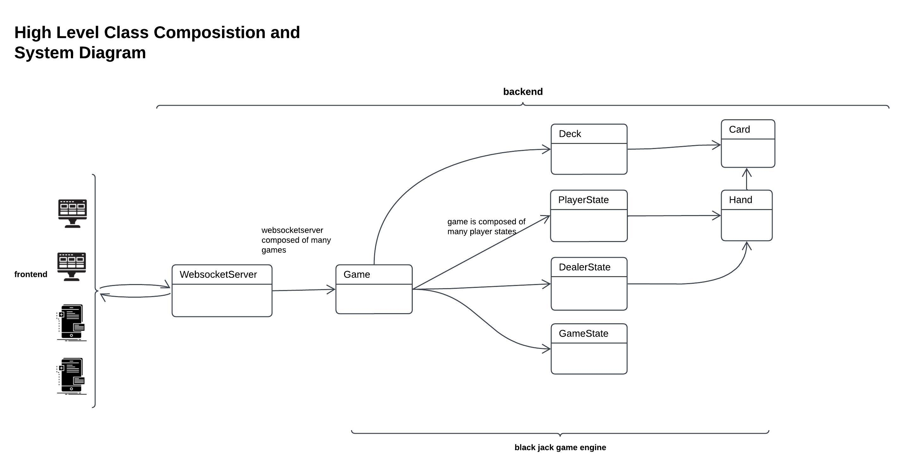
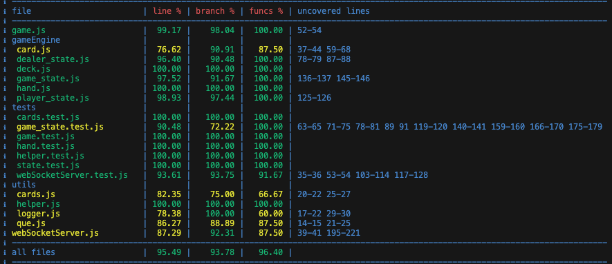
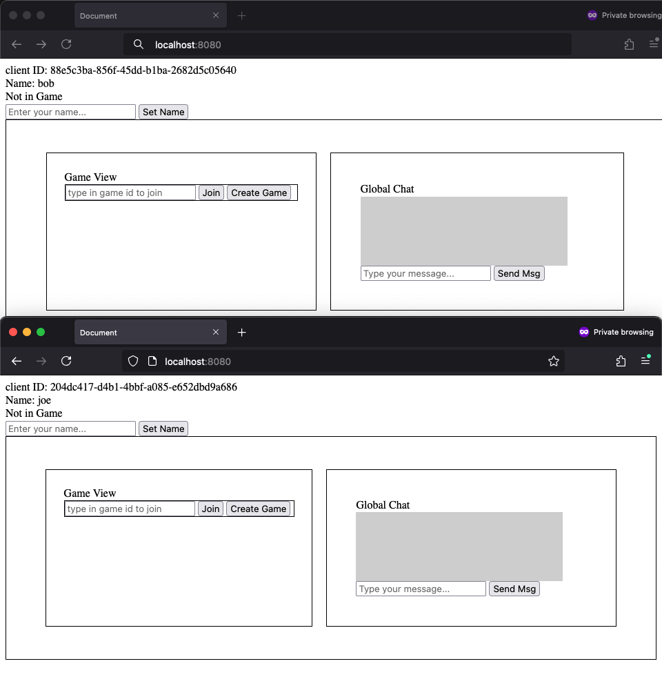
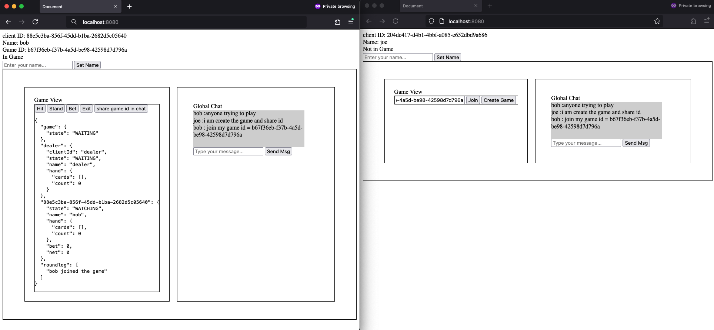
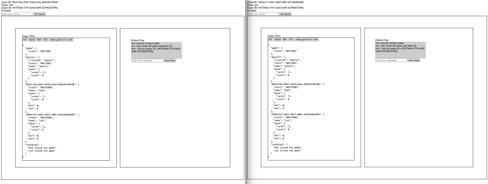
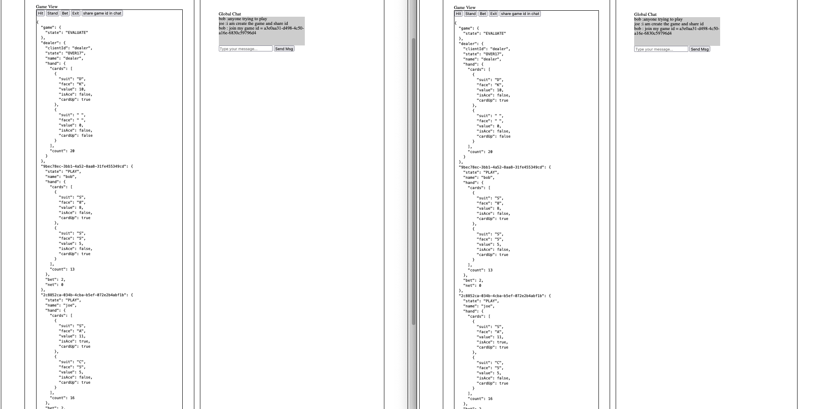
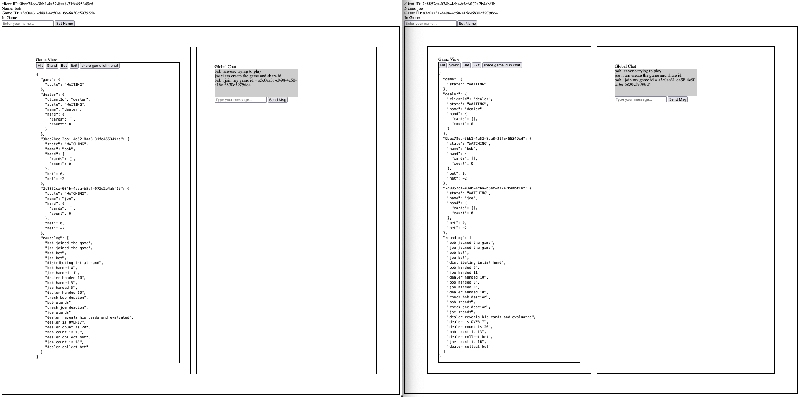

## System



## Run Project

To run the project, navigate to the `backend` directory and execute the following command:

```
cd backend
node index {port}
```

If the `{port}` parameter is not provided, the project will default to port 8080. 

## Run Frontend

To run the frontend, you can access it by navigating to `localhost:{port}` in your web browser. The frontend is automatically served by the backend server when it is run.


## Test Project

To test the project, run the following command:

```
npm run test
```

## Generate Coverage Report

To generate a coverage report, run the following command:

```
npm run test-report
```

## Current Coverage 




## Screenshots





once one player bets dealer will wait for other in game to also bet if a player does bet dealer will skip their turn for the round they will remain in watching state. for this case both joe and bob bet


cards are dealt players have descion to make. Both players chooose to stand



dealer will play their turn and then the winner will be decided. In this case both players lost, as a result they lost bet and their net is -2

