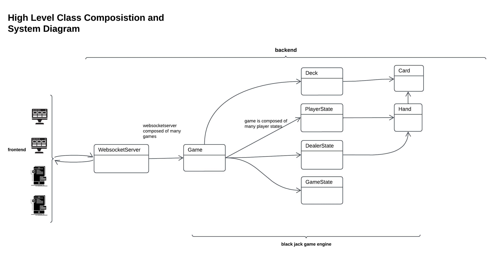
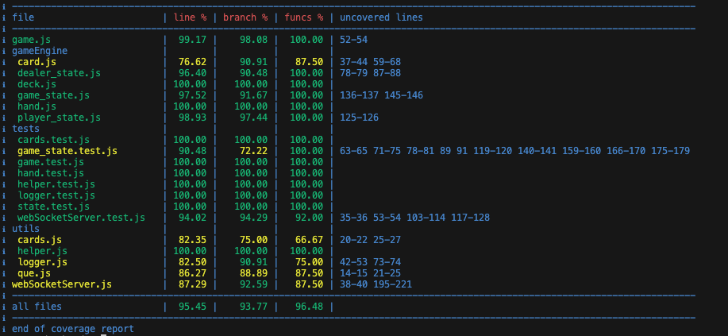
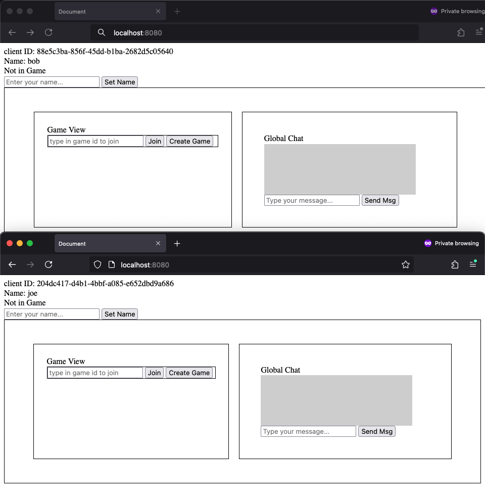
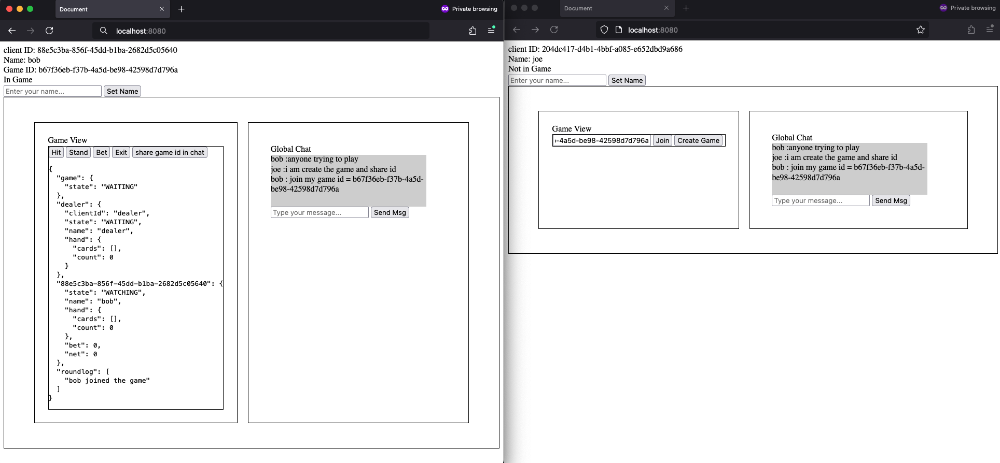
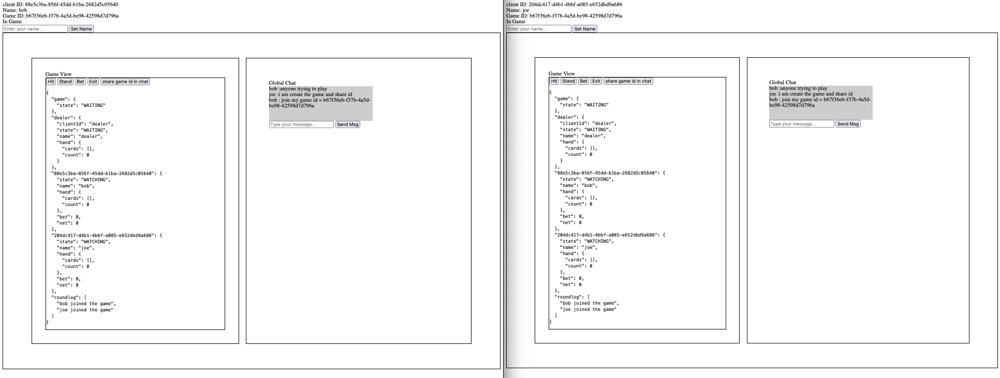
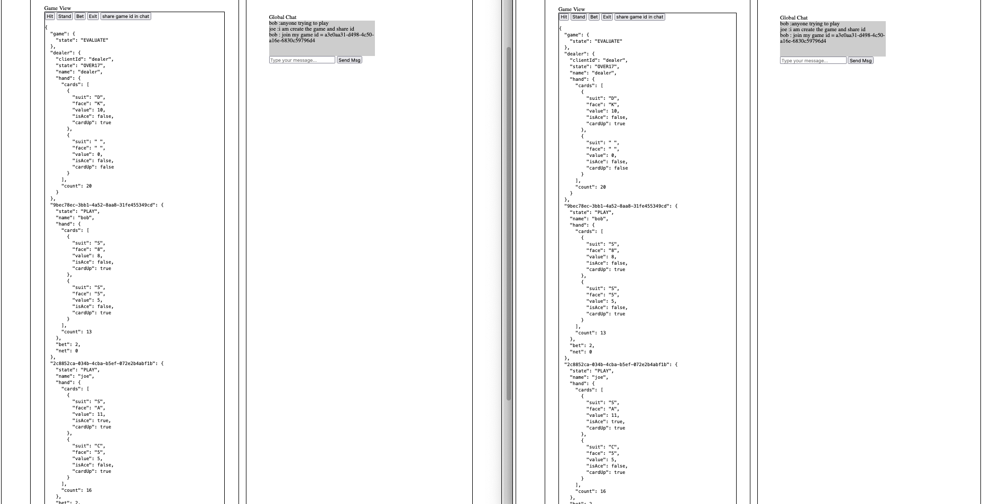
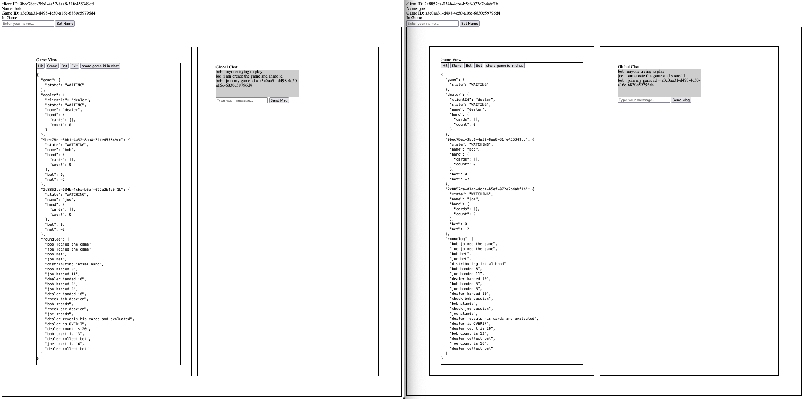

# Blackjack Game Server

## System



## Run Project

To run the project, navigate to the `backend` directory and execute the following command:

```
cd backend
node index {port}
```

If the `{port}` parameter is not provided, the project will default to port 8080. 

## Run Frontend

To run the frontend, you can access it by navigating to `localhost:{port}` in your web browser. The frontend is automatically served by the backend server when it is run.


## Test Project

To test the project, run the following command:

```
npm run test
```

## Generate Coverage Report

To generate a coverage report, run the following command:

```
npm run test-report
```

## Current Coverage 





## Screenshots

### Landing page



### Joining the Game



### Waiting on Bet

Once one player bets, the dealer will wait for the other players in the game to also bet. If a player does not bet, the dealer will skip their turn for the round and they will remain in a watching state. In this case, both Joe and Bob have placed their bets.



### In the Middle of a Round

After the bets are placed, the cards are dealt and the players have decisions to make. if player does not decide server will assume their action to be stand In this case, both players choose to stand.



### Winner Decided

The dealer will play their turn and then the winner will be decided. In this case, both players lost the round as dealer had higher count, resulting in a loss of their bets. Their net balance is -2. You can see based on the logs all the actions that took place during this round.




## License

This project is licensed under the MIT License - see the [LICENSE](./LICENSE) file for details.

## Card Deck png and svg Attribution

The images used in this project are sourced from [Chase Roberts's Repository](https://github.com/crobertsbmw/deckofcards.git), and are licensed under the MIT License.

