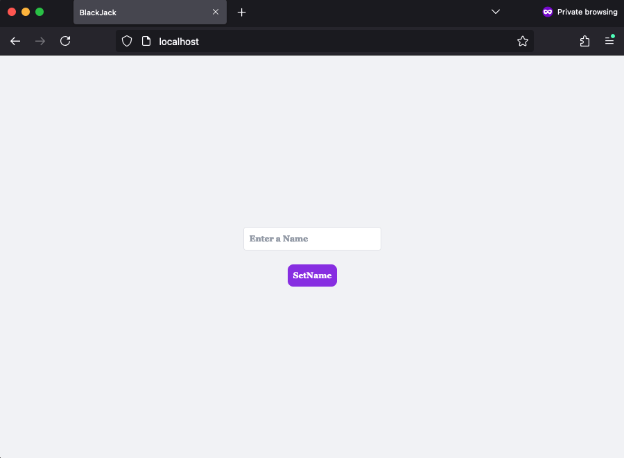
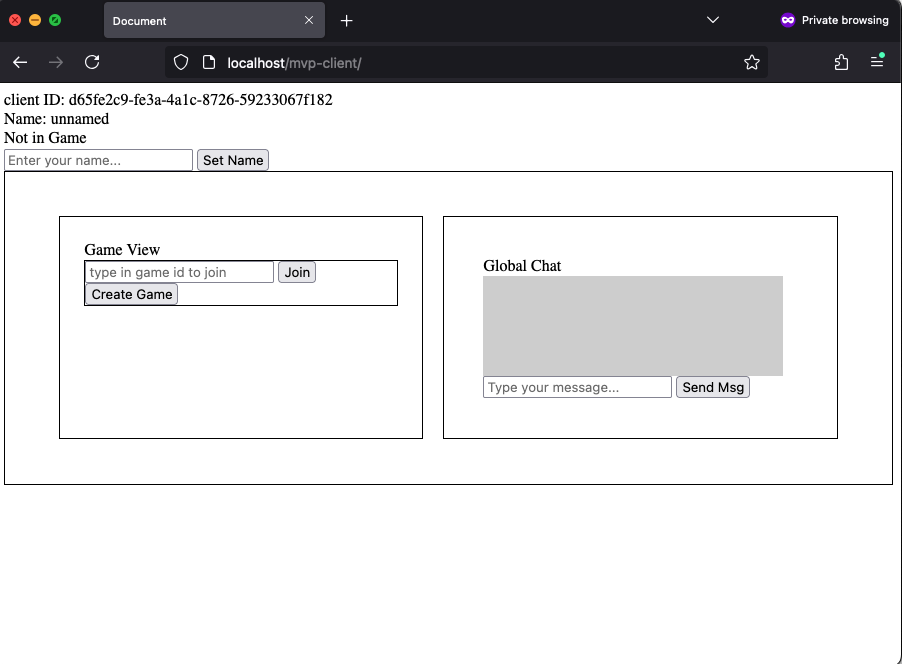

# Blackjack Game Server

## System


## Run Project locally using Docker

The docker-compose file is provided to run the project locally. To run the project, execute the following command:

```
docker-compose -f docker-compose-local.yml up
```
This will compose three services:
1. React Client
2. Mvp Client
3. Backend

the project will be running on http://localhost with port 80 (http)

React Client: http://localhost

Mvp Client: http://localhost/mvp-client


## Test Project

Current test only cover the backend and test are run automatically when the project is built using docker, run the following command in the backend directory to run the tests independently:

```
cd backend
npm run test
```

## Generate Coverage Report

To generate a coverage report, run the following command:

```
npm run test-report
```

## Current Coverage 


## Basic Flow using mvp-client (http://localhost/mvp-client), screeshots taken when port 8080 was used 

### Landing page


### Joining the Game


### Waiting on Bet

Once one player bets, the dealer will wait for the other players in the game to also bet. If a player does not bet, the dealer will skip their turn for the round and they will remain in a watching state. In this case, both Joe and Bob have placed their bets.


### In the Middle of a Round

After the bets are placed, the cards are dealt and the players have decisions to make. if player does not decide server will assume their action to be stand In this case, both players choose to stand.


### Winner Decided

The dealer will play their turn and then the winner will be decided. In this case, both players lost the round as dealer had higher count, resulting in a loss of their bets. Their net balance is -2. You can see based on the logs all the actions that took place during this round.


## License

This project is licensed under the MIT License - see the [LICENSE](./LICENSE) file for details.

## Card Deck images

The images used in this project are sourced from [Chase Roberts's Repository](https://github.com/crobertsbmw/deckofcards.git), and are licensed under the MIT License.

